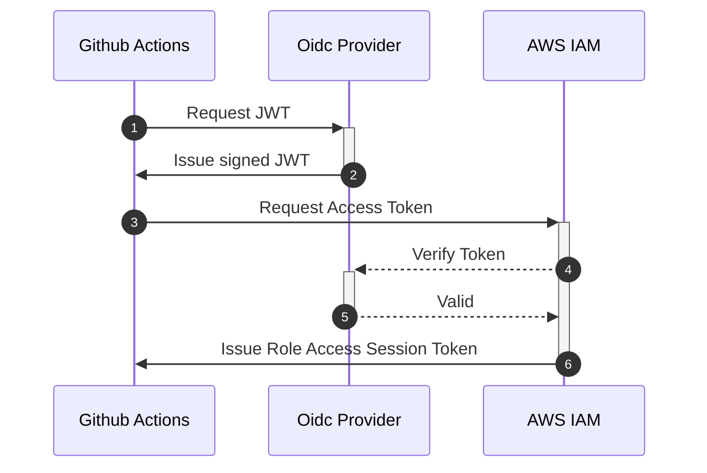

# Terraform Github Actions AWS OIDC Demo

This repo explores setting up AWS OIDC authentication with Github actions so we dont need to configure static AWS Tokens as secrets to run Terraform from within an action.

# Github actions temporary credentials

We can use OpenID Connect within our workflows to authenticate with Amazon Web Services and get temporary session tokens to assume IAM roles.



**Example workflow**

```
name: Test
on:
  push:

jobs:
  test:
    permissions:
      id-token: write
    runs-on: ubuntu-latest
    steps:
      - name: configure aws credentials
        uses: aws-actions/configure-aws-credentials@v1
        with:
          role-to-assume: arn:aws:iam::${{ secrets.AWS_ACCOUNT_ID }}:role/my-github-actions-role
          role-session-name: gh-actions
          aws-region: eu-north-1

      - name: Print the IAM identity object in stdout
        run: |
          aws sts get-caller-identity
```

# How to deploy this from scratch

In the below steps we will deploy a remote-state backend for both this deploymeent and any others. To acheive least-privilege with terraform provisioing, ideally each terraform deployment should have its own role and scoped permissions to perform exactly what it needs. In the bootstrap deployment we also provision one such role. The role permissions are limited to `ssm, s3, dynambdb`

### One to many

The provider deployment creates a IAM provider that github can connect to and an **itermediary** role that the action workflow will assume. In my implementatios, this role does not have any permissions other than to assume the role created in `bootstrap/`. Your terraform provider code will need to use the assume_role block and `role_arn` attribute in the backend configuration.

### Steps

1. deploy `bootstrap/` directory to setup remote-state and any assumable terraform provisioning roles
2. re-initilize s3 backend for the `bootstrap/`
3. update `local.allow_roles_list` in the `provider/main.tf` with role/s for github action to assume, which you created in eg. ``bootstrap/github-oidc-demo-role.tf`.
4. update `local.allow_repos_subs` with subject\s related to your github owner and or specific repo\s.
5. initilize s3 backend for the `provider/` deployment and deploy
6. create github secrets `AWS_DEV_OIDC_ROLE` and `AWS_DEV_OIDC_REGION`.
   > TODO: we should deploy the secrets with the github provider
7. create a demo repo called `terraform-aws-something` use the template files in `demo/` or run the demo directly from this project
8. update your demo repo backend and assume_role blocks with s3 backend and role created in bootstrap
